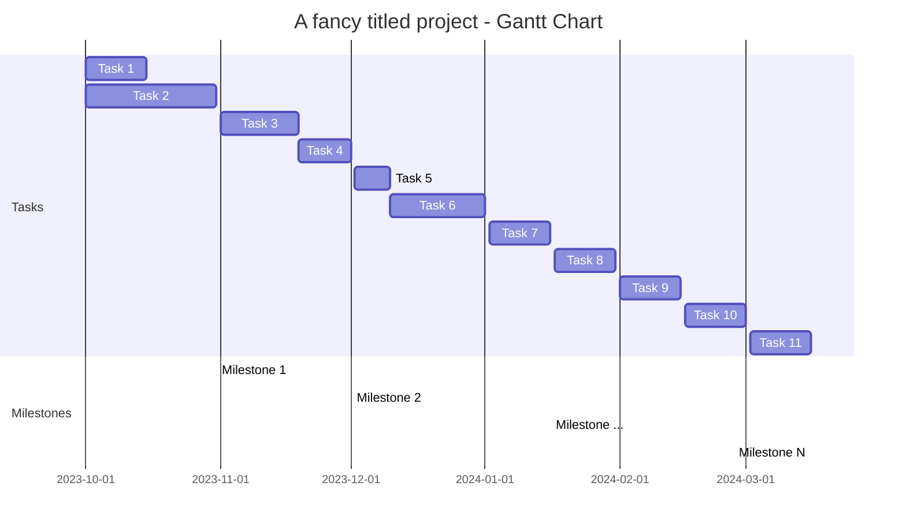

# Very Good Team BAZOOKA TANK - Project Schedule

## Tasks
 - Task 1: The General plan of the project such as (project charter,choose software language,submission of the general plan of the project to the professor).
   
 - Task 2: Making the necessary arrangments in the general plan,determing the sensors and devices to be used,presenting the final version of the project plan.
   
 - Task 3: Write the first software steps to control platform movement (e.g., speed, direction) using an python programming language. Develop functions for sensor input and decision-making algorithms.
   
 - Task 4: Build a user interface (UI) for controlling the mobile platform,via a remote application. Implement communication protocols (Bluetooth or Wi-Fi).
   
 - Task 5: Software Testing and Debugging (as everything goes well as planned :))
   
 - Task 6: ROS Integration Set up ROS to manage hardware drivers and configure.ROS nodes for object detection, mapping, and path planning. Additionally, consider using Zephyr for real-time system capabilities (if we needed).

 - Task 7: Checking the details,looking for errors. (continuation of task 6)
   
 - Task 8: Build the mobile platform according to the design that we specification, sensor placement and wiring. Ensure all components are securely mounted and connected.
   
 - Task 9: Conduct a comprehensive system test to ensure all hardware components and software functions are operating as intended. Address any issues identified during the testing phase.
   
 - Task 10: Optimize the platform for performance by motor controls, sensor calibration.
   
 - Task 11: Document the entire project development, including design choices, wiring diagrams, and software architecture.

   
## Milestones
 - Milestone no. 1: This includes the initial stages of planning and the start of software development,complete the general project planning and establish the foundation for platform movement due to 22.11.24

 - Milestone no. 2: Focuses on user interface creation, software testing, and ROS integration due to 20.12.24

 - Milestone no. 3: Focuses on integrating the available mobile platform with all hardware components and optimizing its performance due to 17.01.25
   
 - Milestone no. 4: Final presentation of the project and documentation due to 24.01.25

 ## Gantt chart : The Gantt Chart shows the timeline of each task and its relation to the corresponding milestone.
Tasks are aligned chronologically from October 2024 to January 2025, showing a steady progression through different phases of the project.

More about how to make a gantt chart in mermaid, you will find here: [Mermaid Gantt](https://mermaid.js.org/syntax/gantt.html)
